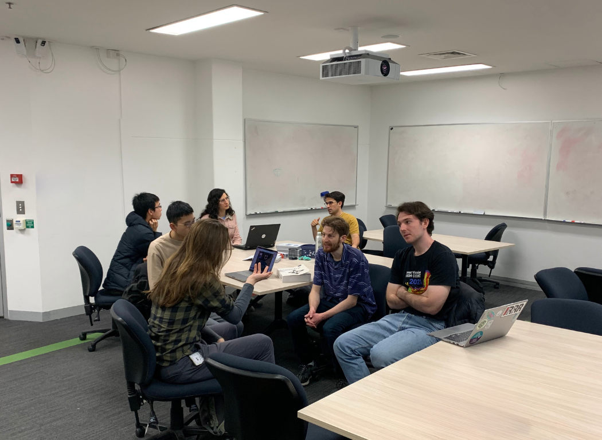
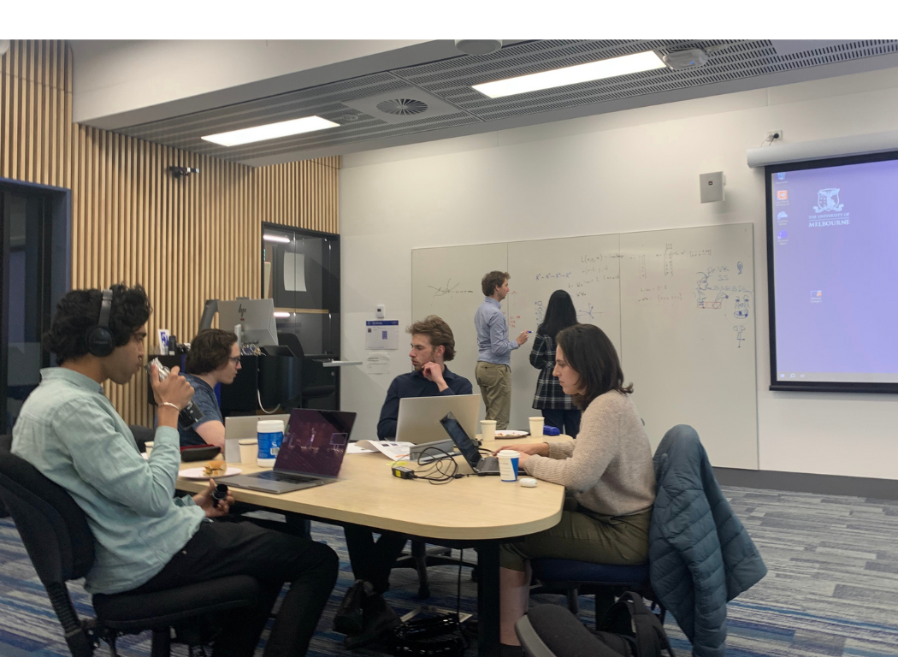
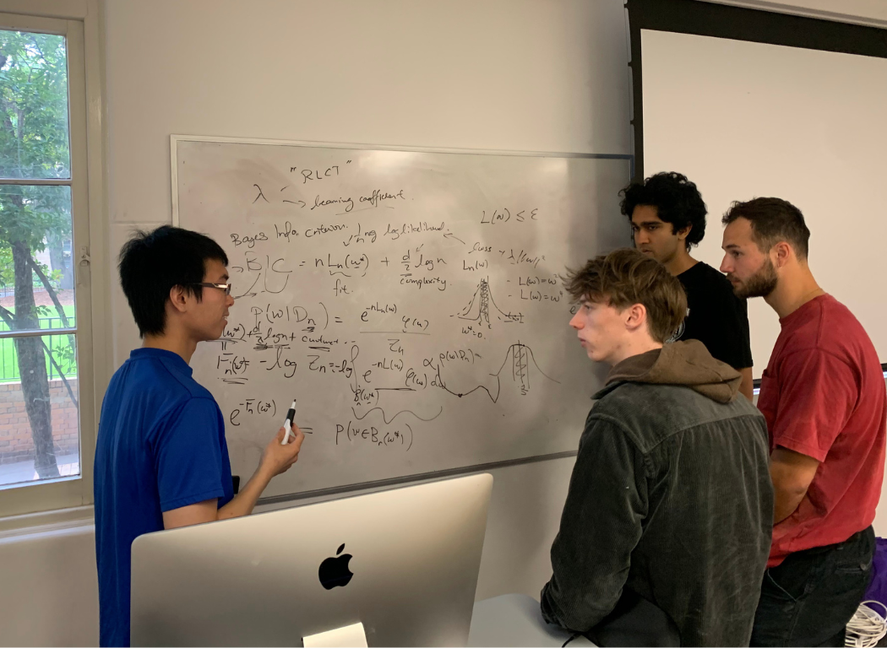
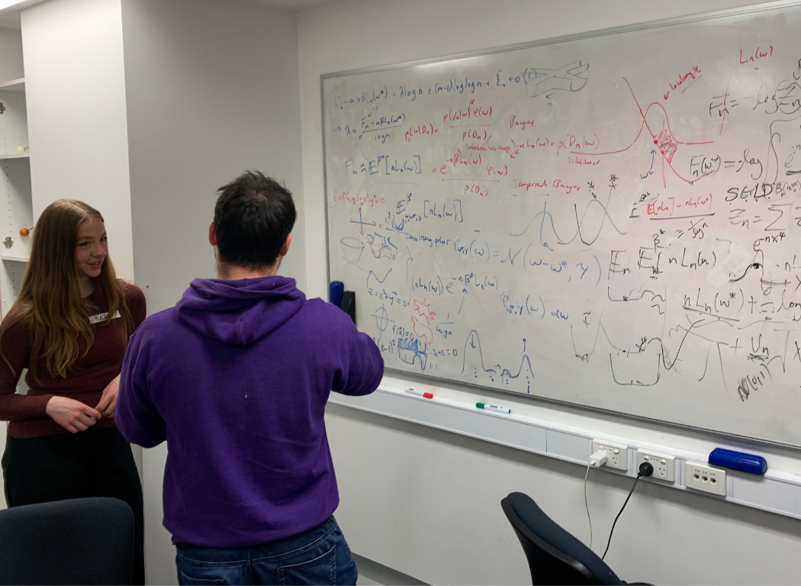

We're an open and inclusive community group that aims to support everyone in understanding, advocating for, and contributing to the field of AI safety.

We run events on a monthly basis that are suitable for wide-ranging audiences; for technically-inclined audiences we run research presentations and hackathons. For those who want to help shape the governance of AI, we run events with Good Ancestors Policy that assist with their policy analysis and advocacy campaigns.

If you're concerned about issues such as the opacity of frontier AI systems, or potential malicious applications of AI, then we encourage you to get involved.

The best way to find out about events and other opportunities is by signing up for updates via email: [https://eepurl.com/iuqHgY](https://eepurl.com/iuqHgY)

## Event spotlight: October 2023 - Developmental Interpretability Hackathon

We collaborated with UniMelb's Responsible AI Development society and local AI safety organisation Timaeus to put on a 2-day hackathon. The aim of the event was to use a newly discovered measure of model complexity, called the ‘learning coefficient’, to measure the effect of different architectures and training methods.

This work was part of the Developmental Interpretability research agenda that is being pioneered by researchers at UniMelb.

